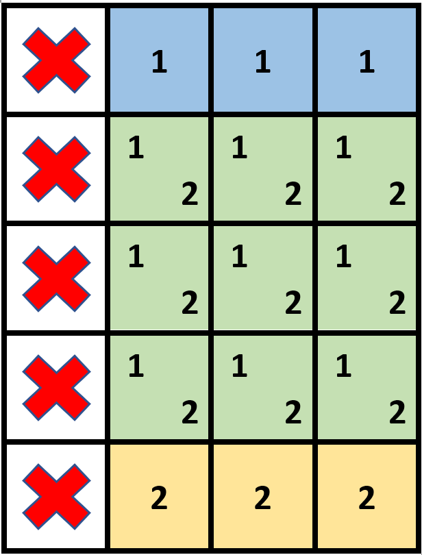
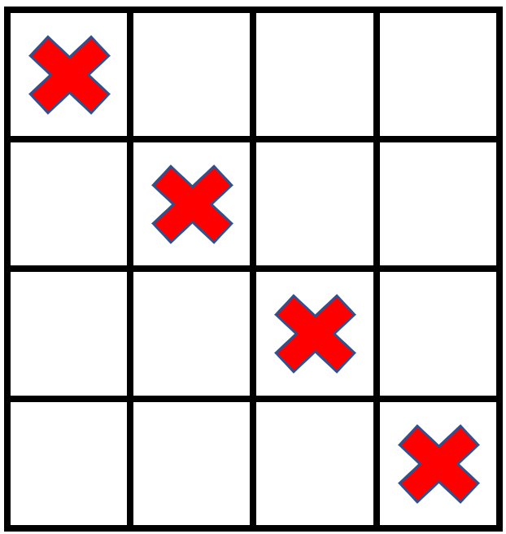

# 2132. Stamping the Grid  Hard

You are given an m x n binary matrix grid where each cell is either 0 (empty) or 1 (occupied).

You are then given stamps of size stampHeight x stampWidth. We want to fit the stamps such that they follow the given restrictions and requirements:

1. Cover all the empty cells.
2. Do not cover any of the occupied cells.
3. We can put as many stamps as we want.
4. Stamps can overlap with each other.
5. Stamps are not allowed to be rotated.
6. Stamps must stay completely inside the grid.

Return true if it is possible to fit the stamps while following the given restrictions and requirements. Otherwise, return false.

Example 1:

<pre>
Input: grid = [[1,0,0,0],[1,0,0,0],[1,0,0,0],[1,0,0,0],[1,0,0,0]], stampHeight = 4, stampWidth = 3
Output: true
Explanation: We have two overlapping stamps (labeled 1 and 2 in the image) that are able to cover all the empty cells.
</pre>

Example 2:

<pre>
Input: grid = [[1,0,0,0],[0,1,0,0],[0,0,1,0],[0,0,0,1]], stampHeight = 2, stampWidth = 2 
Output: false 
Explanation: There is no way to fit the stamps onto all the empty cells without the stamps going outside the grid.
</pre>

Constraints:

- `m == grid.length`
- `n == grid[r].length`
- `1 <= m, n <= 10^5`
- `1 <= m * n <= 2 * 10^5`
- `grid[r][c] is either 0 or 1.`
- `1 <= stampHeight, stampWidth <= 10^5`

 Related Topics 

-   `Prefix Sum`
-   `Sweepline`

