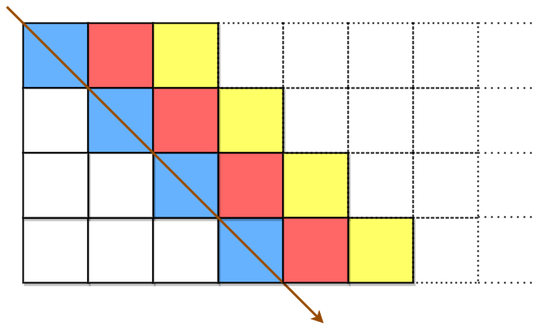
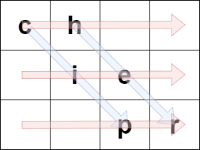
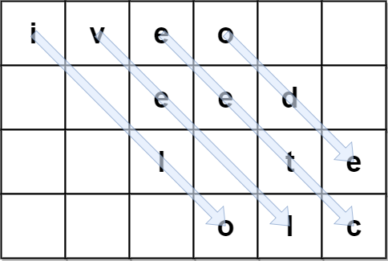
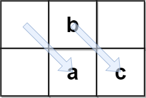

# 2075. Decode the Slanted Ciphertext  Medium

A string originalText is encoded using a slanted transposition cipher to a string encodedText with the help of a matrix having a fixed number of rows rows.

originalText is placed first in a top-left to bottom-right manner.

The blue cells are filled first, followed by the red cells, then the yellow cells, and so on, until we reach the end of originalText. The arrow indicates the order in which the cells are filled. All empty cells are filled with ' '. The number of columns is chosen such that the rightmost column will not be empty after filling in originalText.

encodedText is then formed by appending all characters of the matrix in a row-wise fashion.

The characters in the blue cells are appended first to encodedText, then the red cells, and so on, and finally the yellow cells. The arrow indicates the order in which the cells are accessed.

For example, if originalText = "cipher" and rows = 3, then we encode it in the following manner:

The blue arrows depict how originalText is placed in the matrix, and the red arrows denote the order in which encodedText is formed. In the above example, encodedText = "ch ie pr".

Given the encoded string encodedText and number of rows rows, return the original string originalText.

Note: originalText does not have any trailing spaces ' '. The test cases are generated such that there is only one possible originalText.

Example 1:

<pre>
Input: encodedText = "ch   ie   pr", rows = 3
Output: "cipher"
Explanation: This is the same example described in the problem description.
</pre>

Example 2:

<pre>
Input: encodedText = "iveo    eed   l te   olc", rows = 4
Output: "i love leetcode"
Explanation: The figure above denotes the matrix that was used to encode originalText. 
The blue arrows show how we can find originalText from encodedText.
</pre>

Example 3:

<pre>
Input: encodedText = "coding", rows = 1
Output: "coding"
Explanation: Since there is only 1 row, both originalText and encodedText are the same.
</pre>

Example 4:

<pre>
Input: encodedText = " b  ac", rows = 2
Output: " abc"
Explanation: originalText cannot have trailing spaces, but it may be preceded by one or more spaces.
</pre>

Constraints:

- `0 <= encodedText.length <= 10^6`
- `encodedText consists of lowercase English letters and ' ' only.`
- `encodedText is a valid encoding of some originalText that does not have trailing spaces.`
- `1 <= rows <= 1000`
- `The testcases are generated such that there is only one possible originalText.`

 Related Topics 

-	`Array`
-   `String`

