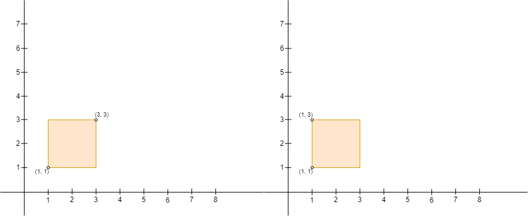
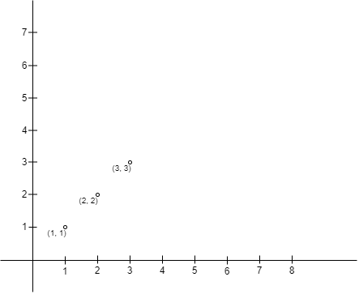
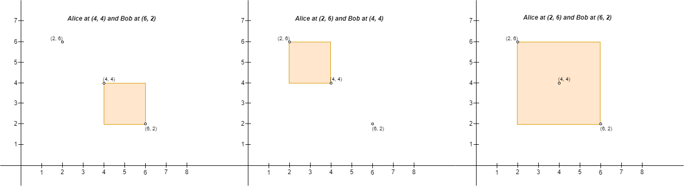

# 3027. Find the Number of Ways to Place People II  Hard

You are given a 2D array <code>points</code> of size <code>n x 2</code> representing integer coordinates of some points on a 2D-plane, where <code>points[i] = [xi, yi]</code>.

We define the <strong>right</strong> direction as positive x-axis (<strong>increasing x-coordinate</strong>) and the <strong>left</strong> direction as negative x-axis (<strong>decreasing x-coordinate</strong>). Similarly, we define the <strong>up</strong> direction as positive y-axis (<strong>increasing y-coordinate</strong>) and the <strong>down</strong> direction as negative y-axis (<strong>decreasing y-coordinate</strong>)

You have to place <code>n</code> people, including Alice and Bob, at these points such that there is <strong>exactly one</strong> person at every point. Alice wants to be alone with Bob, so Alice will build a rectangular fence with Alice&#39;s position as the <strong>upper left corner</strong> and Bob&#39;s position as the <strong>lower right corner</strong> of the fence (<strong>Note</strong> that the fence <strong>might not</strong> enclose any area, i.e. it can be a line). If any person other than Alice and Bob is either <strong>inside</strong> the fence or <strong>on</strong> the fence, Alice will be sad.

Return <em>the number of <strong>pairs of points</strong> where you can place Alice and Bob, such that Alice <strong>does not</strong> become sad on building the fence</em>.

<strong>Note</strong> that Alice can only build a fence with Alice&#39;s position as the upper left corner, and Bob&#39;s position as the lower right corner. For example, Alice cannot build either of the fences in the picture below with four corners <code>(1, 1)</code>, <code>(1, 3)</code>, <code>(3, 1)</code>, and <code>(3, 3)</code>, because:

<ul>
	<li>With Alice at <code>(3, 3)</code> and Bob at <code>(1, 1)</code>, Alice&#39;s position is not the upper left corner and Bob&#39;s position is not the lower right corner of the fence.</li>
	<li>With Alice at <code>(1, 3)</code> and Bob at <code>(1, 1)</code>, Bob&#39;s position is not the lower right corner of the fence.</li>
</ul>

&nbsp;

<strong class="example">Example 1:</strong>

<pre>
<strong>Input:</strong> points = [[1,1],[2,2],[3,3]]
<strong>Output:</strong> 0
<strong>Explanation:</strong> There is no way to place Alice and Bob such that Alice can build a fence with Alice&#39;s position as the upper left corner and Bob&#39;s position as the lower right corner. Hence we return 0. 
</pre>

<strong class="example">Example 2:</strong>

<pre>
<strong>Input:</strong> points = [[6,2],[4,4],[2,6]]
<strong>Output:</strong> 2
<strong>Explanation:</strong> There are two ways to place Alice and Bob such that Alice will not be sad:
- Place Alice at (4, 4) and Bob at (6, 2).
- Place Alice at (2, 6) and Bob at (4, 4).
You cannot place Alice at (2, 6) and Bob at (6, 2) because the person at (4, 4) will be inside the fence.
</pre>

<strong class="example">Example 3:</strong>

<pre>
<strong>Input:</strong> points = [[3,1],[1,3],[1,1]]
<strong>Output:</strong> 2
<strong>Explanation:</strong> There are two ways to place Alice and Bob such that Alice will not be sad:
- Place Alice at (1, 1) and Bob at (3, 1).
- Place Alice at (1, 3) and Bob at (1, 1).
You cannot place Alice at (1, 3) and Bob at (3, 1) because the person at (1, 1) will be on the fence.
Note that it does not matter if the fence encloses any area, the first and second fences in the image are valid.
</pre>

&nbsp;

<strong>Constraints:</strong>

<ul>
	<li><code>2 &lt;= n &lt;= 1000</code></li>
	<li><code>points[i].length == 2</code></li>
	<li><code>-109 &lt;= points[i][0], points[i][1] &lt;= 109</code></li>
	<li>All <code>points[i]</code> are distinct.</li>
</ul>

 Related Topics 

-	`Array`
-	`Math`
-	`Geometry`
-	`Sorting`
-	`Enumeration`

 Hint 1 

Sort the points by x-coordinate in non-decreasing order and break the tie by sorting the y-coordinate in non-increasing order.

 Hint 2 

Now consider two points upper-left corner <code>points[i]</code> and lower-right corner <code>points[j]</code>, such that <code>i < j</code> and <code>points[i][0] <= points[j][0]</code> and <code>points[i][1] >= points[j][1]</code>.

 Hint 3 

Instead of brute force looping, we can save the largest y-coordinate that is no larger than <code>points[i][1]</code> when looping on <code>j</code>, say the value is <code>m</code>. And if <code>m < points[j][1]</code>, the upper-left and lower-right corner pair is valid.

 Hint 4 

The actual values don’t matter, we can compress all x-coordinates and y-coordinates to the range <code>[1, n]</code>. Can we use prefix sum now?

