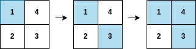
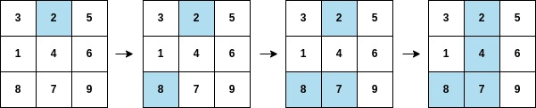

# 2661. First Completely Painted Row or Column  Medium

You are given a <strong>0-indexed</strong> integer array <code>arr</code>, and an <code>m x n</code> integer <strong>matrix</strong> <code>mat</code>. <code>arr</code> and <code>mat</code> both contain <strong>all</strong> the integers in the range <code>[1, m * n]</code>.

Go through each index <code>i</code> in <code>arr</code> starting from index <code>0</code> and paint the cell in <code>mat</code> containing the integer <code>arr[i]</code>.

Return <em>the smallest index</em> <code>i</code> <em>at which either a row or a column will be completely painted in</em> <code>mat</code>.

&nbsp;

<strong class="example">Example 1:</strong>

<pre>
<strong>Input:</strong> arr = [1,3,4,2], mat = [[1,4],[2,3]]
<strong>Output:</strong> 2
<strong>Explanation:</strong> The moves are shown in order, and both the first row and second column of the matrix become fully painted at arr[2].
</pre>

<strong class="example">Example 2:</strong>

<pre>
<strong>Input:</strong> arr = [2,8,7,4,1,3,5,6,9], mat = [[3,2,5],[1,4,6],[8,7,9]]
<strong>Output:</strong> 3
<strong>Explanation:</strong> The second column becomes fully painted at arr[3].
</pre>

&nbsp;

<strong>Constraints:</strong>

<ul>
	<li><code>m == mat.length</code></li>
	<li><code>n = mat[i].length</code></li>
	<li><code>arr.length == m * n</code></li>
	<li><code>1 &lt;= m, n &lt;= 105</code></li>
	<li><code>1 &lt;= m * n &lt;= 105</code></li>
	<li><code>1 &lt;= arr[i], mat[r][c] &lt;= m * n</code></li>
	<li>All the integers of <code>arr</code> are <strong>unique</strong>.</li>
	<li>All the integers of <code>mat</code> are <strong>unique</strong>.</li>
</ul>

 Related Topics 

-	`Array`
-	`Hash Table`
-	`Matrix`

 Hint 1 

Can we use a frequency array?

 Hint 2 

Pre-process the positions of the values in the matrix.

 Hint 3 

Traverse the array and increment the corresponding row and column frequency using the pre-processed positions.

 Hint 4 

If the row frequency becomes equal to the number of columns, or vice-versa return the current index.

