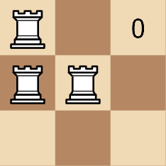

# 3189. Minimum Moves to Get a Peaceful Board  Medium

Given a 2D array <code>rooks</code> of length <code>n</code>, where <code>rooks[i] = [xi, yi]</code> indicates the position of a rook on an <code>n x n</code> chess board. Your task is to move the rooks <strong>1 cell </strong>at a time vertically or horizontally (to an <em>adjacent</em> cell) such that the board becomes <strong>peaceful</strong>.

A board is <strong>peaceful</strong> if there is <strong>exactly</strong> one rook in each row and each column.

Return the <strong>minimum</strong> number of moves required to get a <em>peaceful board</em>.

<strong>Note</strong> that <strong>at no point</strong> can there be two rooks in the same cell.

&nbsp;

<strong class="example">Example 1:</strong>

<strong>Input:</strong> rooks = [[0,0],[1,0],[1,1]]

<strong>Output:</strong> 3

<strong>Explanation:</strong>

<strong class="example">Example 2:</strong>

<strong>Input:</strong> rooks = [[0,0],[0,1],[0,2],[0,3]]

<strong>Output:</strong> 6

<strong>Explanation:</strong>

&nbsp;

<strong>Constraints:</strong>

<ul>
	<li><code>1 &lt;= n == rooks.length &lt;= 500</code></li>
	<li><code>0 &lt;= xi, yi &lt;= n - 1</code></li>
	<li>The input is generated such that there are no 2 rooks in the same cell.</li>
</ul>

 Related Topics 

-	`Array`
-	`Greedy`
-	`Sorting`
-	`Counting Sort`

 Hint 1 

Think of a greedy method.

 Hint 2 

First, distribute the rooks in individual rows.

 Hint 3 

You can do this by sorting all rooks by their rows. Then assign the first one to the first row, the second one to the second row, and so on.

 Hint 4 

After you've distributed rooks across all rows, now do the same for columns.

 Hint 5 

Sort rooks by their columns and then assign the first one to the first column and so on.

