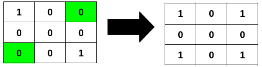

# 3239. Minimum Number of Flips to Make Binary Grid Palindromic I  Medium

You are given an <code>m x n</code> binary matrix <code>grid</code>.

A row or column is considered <strong>palindromic</strong> if its values read the same forward and backward.

You can <strong>flip</strong> any number of cells in <code>grid</code> from <code>0</code> to <code>1</code>, or from <code>1</code> to <code>0</code>.

Return the <strong>minimum</strong> number of cells that need to be flipped to make <strong>either</strong> all rows <strong>palindromic</strong> or all columns <strong>palindromic</strong>.

&nbsp;

<strong class="example">Example 1:</strong>

<strong>Input:</strong> grid = [[1,0,0],[0,0,0],[0,0,1]]

<strong>Output:</strong> 2

<strong>Explanation:</strong>

Flipping the highlighted cells makes all the rows palindromic.

<strong class="example">Example 2:</strong>

<strong>Input:</strong> grid = [[0,1],[0,1],[0,0]]

<strong>Output:</strong> 1

<strong>Explanation:</strong>

Flipping the highlighted cell makes all the columns palindromic.

<strong class="example">Example 3:</strong>

<strong>Input:</strong> grid = [[1],[0]]

<strong>Output:</strong> 0

<strong>Explanation:</strong>

All rows are already palindromic.

&nbsp;

<strong>Constraints:</strong>

<ul>
	<li><code>m == grid.length</code></li>
	<li><code>n == grid[i].length</code></li>
	<li><code>1 &lt;= m * n &lt;= 2 * 105</code></li>
	<li><code>0 &lt;= grid[i][j] &lt;= 1</code></li>
</ul>

 Related Topics 

-	`Array`
-	`Two Pointers`
-	`Matrix`

 Hint 1 

We need to perform the operation only when the equivalent element of <code>i</code> from the back is not equal.

