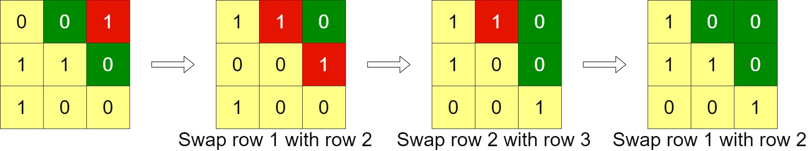

# 1536. Minimum Swaps to Arrange a Binary Grid  Medium

Given an n x n binary grid, in one step you can choose two adjacent rows of the grid and swap them.

A grid is said to be valid if all the cells above the main diagonal are zeros.

Return the minimum number of steps needed to make the grid valid, or -1 if the grid cannot be valid.

The main diagonal of a grid is the diagonal that starts at cell (1, 1) and ends at cell (n, n).

Example 1:

<pre>
Input: grid = [[0,0,1],[1,1,0],[1,0,0]]
Output: 3
</pre>

Example 2:

<pre>
Input: grid = [[0,1,1,0],[0,1,1,0],[0,1,1,0],[0,1,1,0]]
Output: -1
Explanation: All rows are similar, swaps have no effect on the grid.
</pre>

Constraints:

- `n == grid.length`
- `n == grid[i].length`
- `1 <= n <= 200`
- `grid[i][j] is 0 or 1`

 Related Topics 

-   `Matrix`
-   `Greedy`

