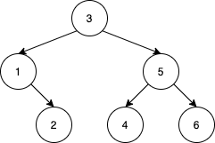

# 1569. Number of Ways to Reorder Array to Get Same BST  Hard

Given an array nums that represents a permutation of integers from 1 to n. We are going to construct a binary search tree (BST) by inserting the elements of nums in order into an initially empty BST. Find the number of different ways to reorder nums so that the constructed BST is identical to that formed from the original array nums.

For example, given nums = [2,1,3], we will have 2 as the root, 1 as a left child, and 3 as a right child. The array [2,3,1] also yields the same BST but [3,2,1] yields a different BST.

Return the number of ways to reorder nums such that the BST formed is identical to the original BST formed from nums.

Since the answer may be very large, return it modulo 10^9 + 7.

Example 1:

<pre>
Input: nums = [2,1,3]
Output: 1
Explanation: We can reorder nums to be [2,3,1] which will yield the same BST. There are no other ways to reorder nums which will yield the same BST.
</pre>

Example 2:

<pre>
Input: nums = [3,4,5,1,2]
Output: 5
Explanation: The following 5 arrays will yield the same BST: 
[3,1,2,4,5]
[3,1,4,2,5]
[3,1,4,5,2]
[3,4,1,2,5]
[3,4,1,5,2]
</pre>

Example 3:

<pre>
Input: nums = [1,2,3]
Output: 0
Explanation: There are no other orderings of nums that will yield the same BST.
</pre>

Example 4:

<pre>
Input: nums = [3,1,2,5,4,6]
Output: 19
</pre>

Constraints:

-   `Constraint 1`
-   `Constraint 2`
-   `Constraint 3`

 Related Topics 

-   `Topic 1`
-   `Topic 2`

 Hint 1 

Hint 1

 Hint 2 

Hint 2

 Hint 3 

Hint 3

 Hint 4 

Hint 4

