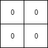

# 1428. Leftmost Column with at Least a One  Medium

A <strong>row-sorted binary matrix</strong> means that all elements are <code>0</code> or <code>1</code> and each row of the matrix is sorted in non-decreasing order.

Given a <strong>row-sorted binary matrix</strong> <code>binaryMatrix</code>, return <em>the index (0-indexed) of the <strong>leftmost column</strong> with a 1 in it</em>. If such an index does not exist, return <code>-1</code>.

<strong>You can&#39;t access the Binary Matrix directly.</strong> You may only access the matrix using a <code>BinaryMatrix</code> interface:

<ul>
	<li><code>BinaryMatrix.get(row, col)</code> returns the element of the matrix at index <code>(row, col)</code> (0-indexed).</li>
	<li><code>BinaryMatrix.dimensions()</code> returns the dimensions of the matrix as a list of 2 elements <code>[rows, cols]</code>, which means the matrix is <code>rows x cols</code>.</li>
</ul>

Submissions making more than <code>1000</code> calls to <code>BinaryMatrix.get</code> will be judged <em>Wrong Answer</em>. Also, any solutions that attempt to circumvent the judge will result in disqualification.

For custom testing purposes, the input will be the entire binary matrix <code>mat</code>. You will not have access to the binary matrix directly.

&nbsp;

<strong class="example">Example 1:</strong>

<pre>
<strong>Input:</strong> mat = [[0,0],[1,1]]
<strong>Output:</strong> 0
</pre>

<strong class="example">Example 2:</strong>

<pre>
<strong>Input:</strong> mat = [[0,0],[0,1]]
<strong>Output:</strong> 1
</pre>

<strong class="example">Example 3:</strong>

<pre>
<strong>Input:</strong> mat = [[0,0],[0,0]]
<strong>Output:</strong> -1
</pre>

&nbsp;

<strong>Constraints:</strong>

<ul>
	<li><code>rows == mat.length</code></li>
	<li><code>cols == mat[i].length</code></li>
	<li><code>1 &lt;= rows, cols &lt;= 100</code></li>
	<li><code>mat[i][j]</code> is either <code>0</code> or <code>1</code>.</li>
	<li><code>mat[i]</code> is sorted in non-decreasing order.</li>
</ul>

 Related Topics 

-	`Array`
-	`Binary Search`
-	`Matrix`
-	`Interactive`

 Hint 1 

1. (Binary Search) For each row do a binary search to find the leftmost one on that row and update the answer.

 Hint 2 

2. (Optimal Approach) Imagine there is a pointer p(x, y) starting from top right corner. p can only move left or down. If the value at p is 0, move down. If the value at p is 1, move left. Try to figure out the correctness and time complexity of this algorithm.

