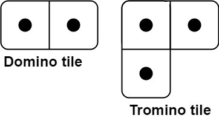

# 790. Domino and Tromino Tiling  Medium

You have two types of tiles: a 2 x 1 domino shape and a tromino shape. You may rotate these shapes.

Given an integer n, return the number of ways to tile an 2 x n board. Since the answer may be very large, return it modulo 109 + 7.

In a tiling, every square must be covered by a tile. Two tilings are different if and only if there are two 4-directionally adjacent cells on the board such that exactly one of the tilings has both squares occupied by a tile.

Example 1:

<pre>
Input: n = 3
Output: 5
Explanation: The five different ways are show above.
</pre>

Example 2:

<pre>
Input: n = 1
Output: 1
</pre>

Constraints:

- `1 <= n <= 1000`

 Related Topics 

-   `Dynamic Programming`

