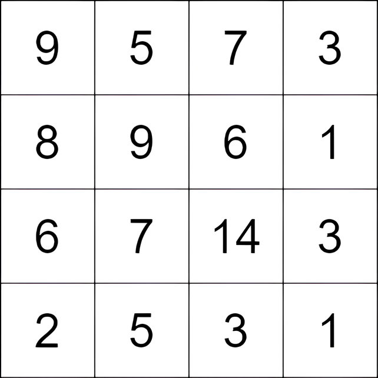
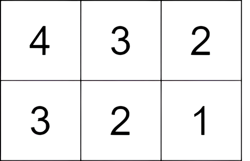

# 3148. Maximum Difference Score in a Grid  Medium

You are given an <code>m x n</code> matrix <code>grid</code> consisting of <strong>positive</strong> integers. You can move from a cell in the matrix to <strong>any</strong> other cell that is either to the bottom or to the right (not necessarily adjacent). The score of a move from a cell with the value <code>c1</code> to a cell with the value <code>c2</code> is <code>c2 - c1</code>.<!-- notionvc: 8819ca04-8606-4ecf-815b-fb77bc63b851 -->

You can start at <strong>any</strong> cell, and you have to make <strong>at least</strong> one move.

Return the <strong>maximum</strong> total score you can achieve.

&nbsp;

<strong class="example">Example 1:</strong>

<strong>Input:</strong> grid = [[9,5,7,3],[8,9,6,1],[6,7,14,3],[2,5,3,1]]

<strong>Output:</strong> 9

<strong>Explanation:</strong> We start at the cell <code>(0, 1)</code>, and we perform the following moves: 
- Move from the cell <code>(0, 1)</code> to <code>(2, 1)</code> with a score of <code>7 - 5 = 2</code>. 
- Move from the cell <code>(2, 1)</code> to <code>(2, 2)</code> with a score of <code>14 - 7 = 7</code>. 
The total score is <code>2 + 7 = 9</code>.

<strong class="example">Example 2:</strong>

<strong>Input:</strong> grid = [[4,3,2],[3,2,1]]

<strong>Output:</strong> -1

<strong>Explanation:</strong> We start at the cell <code>(0, 0)</code>, and we perform one move: <code>(0, 0)</code> to <code>(0, 1)</code>. The score is <code>3 - 4 = -1</code>.

&nbsp;

<strong>Constraints:</strong>

<ul>
	<li><code>m == grid.length</code></li>
	<li><code>n == grid[i].length</code></li>
	<li><code>2 &lt;= m, n &lt;= 1000</code></li>
	<li><code>4 &lt;= m * n &lt;= 105</code></li>
	<li><code>1 &lt;= grid[i][j] &lt;= 105</code></li>
</ul>

 Related Topics 

-	`Array`
-	`Dynamic Programming`
-	`Matrix`

 Hint 1 

Any path from a cell <code>(x1, y1)</code> to another cell <code>(x2, y2)</code> will always have a score of <code>grid[x2][y2] - grid[x1][y1]</code>.

 Hint 2 

Let’s say we fix the starting cell <code>(x1, y1)</code>, how to the find a cell <code>(x2, y2)</code> such that the value <code>grid[x2][y2] - grid[x1][y1]</code> is the maximum possible?

