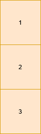

# 3142. Check if Grid Satisfies Conditions  Easy

You are given a 2D matrix <code>grid</code> of size <code>m x n</code>. You need to check if each cell <code>grid[i][j]</code> is:

<ul>
	<li>Equal to the cell below it, i.e. <code>grid[i][j] == grid[i + 1][j]</code> (if it exists).</li>
	<li>Different from the cell to its right, i.e. <code>grid[i][j] != grid[i][j + 1]</code> (if it exists).</li>
</ul>

Return <code>true</code> if <strong>all</strong> the cells satisfy these conditions, otherwise, return <code>false</code>.

&nbsp;

<strong class="example">Example 1:</strong>

<strong>Input:</strong> grid = [[1,0,2],[1,0,2]]

<strong>Output:</strong> true

<strong>Explanation:</strong>

<strong></strong>

All the cells in the grid satisfy the conditions.

<strong class="example">Example 2:</strong>

<strong>Input:</strong> grid = [[1,1,1],[0,0,0]]

<strong>Output:</strong> false

<strong>Explanation:</strong>

<strong></strong>

All cells in the first row are equal.

<strong class="example">Example 3:</strong>

<strong>Input:</strong> grid = [[1],[2],[3]]

<strong>Output:</strong> false

<strong>Explanation:</strong>

Cells in the first column have different values.

&nbsp;

<strong>Constraints:</strong>

<ul>
	<li><code>1 &lt;= n, m &lt;= 10</code></li>
	<li><code>0 &lt;= grid[i][j] &lt;= 9</code></li>
</ul>

 Related Topics 

-	`Array`
-	`Matrix`

 Hint 1 

Check if each column has same value in each cell.

 Hint 2 

If the previous condition is satisfied, we can simply check the first cells in adjacent columns.

