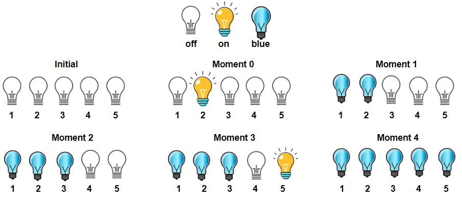

# 1375. Bulb Switcher III  Medium

There is a room with n bulbs, numbered from 1 to n, arranged in a row from left to right. Initially, all the bulbs are turned off.

At moment k (for k from 0 to n - 1), we turn on the light[k] bulb. A bulb changes color to blue only if it is on and all the previous bulbs (to the left) are turned on too.

Return the number of moments in which all turned-on bulbs are blue.

Example 1:

<pre>
Input: light = [2,1,3,5,4]
Output: 3
Explanation: All bulbs turned on, are blue at the moment 1, 2 and 4.
</pre>

Example 2:

<pre>
Input: light = [3,2,4,1,5]
Output: 2
Explanation: All bulbs turned on, are blue at the moment 3, and 4 (index-0).
</pre>

Constraints:

- `n == light.length`
- `1 <= n <= 5 * 10^4`
- `light is a permutation of the numbers in the range [1, n]`

 Related Topics 

-   `Array`
-   `Simulation`

