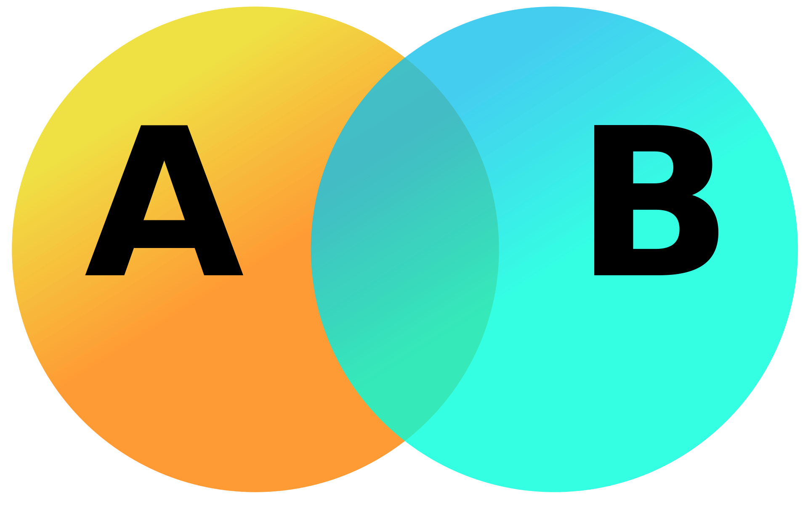
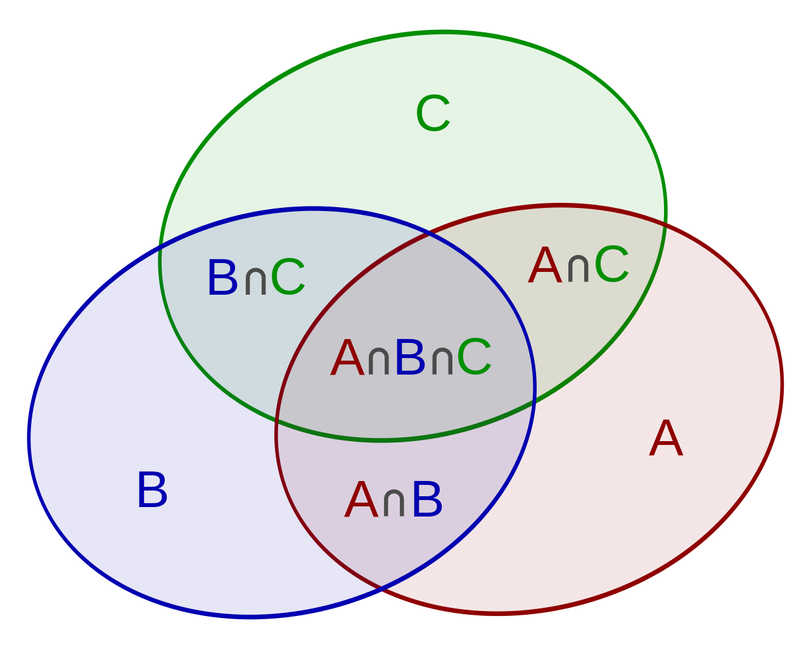

# Inclusion exclusion princicle

## Example: 3116. Kth Smallest Amount With Single Denomination Combination
## Example: 2927. Distribute Candies Among Children III

In combinatorics, a branch of mathematics, the inclusion–exclusion principle is a counting technique which generalizes the familiar method of obtaining the number of elements in the union of two finite sets; symbolically expressed as

where A and B are two finite sets and |S| indicates the cardinality of a set S (which may be considered as the number of elements of the set, if the set is finite). The formula expresses the fact that the sum of the sizes of the two sets may be too large since some elements may be counted twice. The double-counted elements are those in the intersection of the two sets and the count is corrected by subtracting the size of the intersection

The inclusion-exclusion principle, being a generalization of the two-set case, is perhaps more clearly seen in the case of three sets, which for the sets A, B and C is given by

Generalizing the results of these examples gives the principle of inclusion–exclusion. To find the cardinality of the union of n sets:

