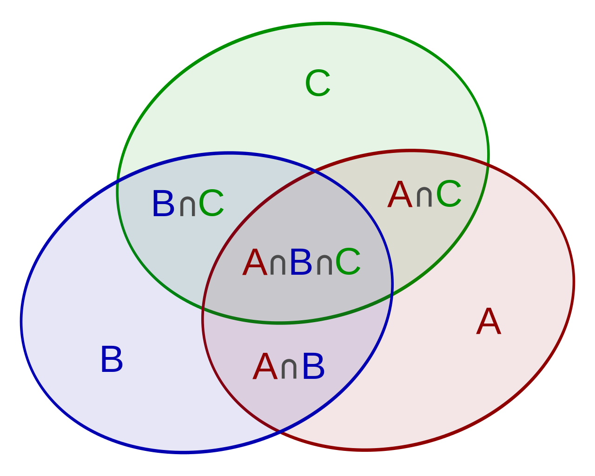

# Inclusion-Exclusion Principle

**Idea:** A counting technique that generalizes the familiar method of finding the size of the union of two finite sets. When you sum the sizes of overlapping sets, elements in the intersection get counted multiple times, so you alternately subtract and add the sizes of the intersections to correct the count.

## Example Problems

- **3116.** Kth Smallest Amount With Single Denomination Combination
- **2927.** Distribute Candies Among Children III

## Two Sets

For two finite sets `A` and `B`:

Here `|S|` is the cardinality of set `S` (the number of elements, if the set is finite). The formula corrects for the fact that summing the two set sizes may overcount: elements lying in both sets are counted twice, so the count is fixed by subtracting the size of the intersection.

## Three Sets

The pattern is clearer with three sets `A`, `B`, and `C`:

## General Form (n Sets)

Generalizing these cases gives the principle of inclusion-exclusion. To find the cardinality of the union of `n` sets:

