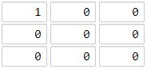

# 1162. As Far from Land as Possible  Medium

Given an n x n grid containing only values 0 and 1, where 0 represents water and 1 represents land, find a water cell such that its distance to the nearest land cell is maximized, and return the distance. If no land or water exists in the grid, return -1.

The distance used in this problem is the Manhattan distance: the distance between two cells (x0, y0) and (x1, y1) is |x0 - x1| + |y0 - y1|.

Example 1:

<pre>
Input: grid = [[1,0,1],[0,0,0],[1,0,1]]
Output: 2
Explanation: The cell (1, 1) is as far as possible from all the land with distance 2.
</pre>

Example 2:

<pre>
Input: grid = [[1,0,0],[0,0,0],[0,0,0]]
Output: 4
Explanation: The cell (2, 2) is as far as possible from all the land with distance 4.
</pre>

Constraints:

- `n == grid.length`
- `n == grid[i].length`
- `1 <= n <= 100`
- `grid[i][j] is 0 or 1`

 Related Topics 

-   `Breadth-first Search`
-   `Matrix`

 Hint 1 

Can you think of this problem in a backwards way ?

 Hint 2 

Imagine expanding outward from each land cell. What kind of search does that ?

 Hint 3 

Use BFS starting from all land cells in the same time.

 Hint 4 

When do you reach the furthest water cell?

