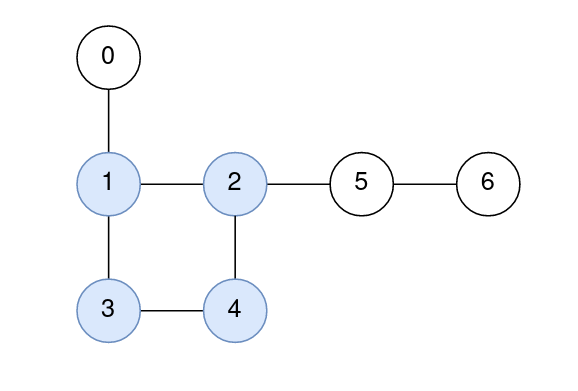
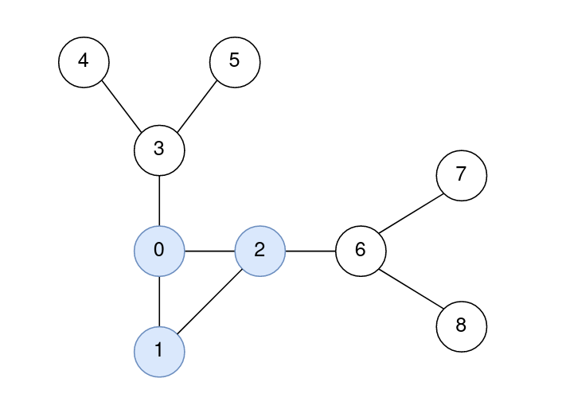

# 2204. Distance to a Cycle in Undirected Graph  Hard

You are given a positive integer <code>n</code> representing the number of nodes in a <strong>connected undirected graph</strong> containing <strong>exactly one</strong> cycle. The nodes are numbered from <code>0</code> to <code>n - 1</code> (<strong>inclusive</strong>).

You are also given a 2D integer array <code>edges</code>, where <code>edges[i] = [node1i, node2i]</code> denotes that there is a <strong>bidirectional</strong> edge connecting <code>node1i</code> and <code>node2i</code> in the graph.

The distance between two nodes <code>a</code> and <code>b</code> is defined to be the <strong>minimum</strong> number of edges that are needed to go from <code>a</code> to <code>b</code>.

Return <em>an integer array <code>answer</code></em><em> of size </em><code>n</code><em>, where </em><code>answer[i]</code><em> is the <strong>minimum</strong> distance between the </em><code>ith</code><em> node and <strong>any</strong> node in the cycle.</em>

&nbsp;

<strong class="example">Example 1:</strong>

<pre>
<strong>Input:</strong> n = 7, edges = [[1,2],[2,4],[4,3],[3,1],[0,1],[5,2],[6,5]]
<strong>Output:</strong> [1,0,0,0,0,1,2]
<strong>Explanation:</strong>
The nodes 1, 2, 3, and 4 form the cycle.
The distance from 0 to 1 is 1.
The distance from 1 to 1 is 0.
The distance from 2 to 2 is 0.
The distance from 3 to 3 is 0.
The distance from 4 to 4 is 0.
The distance from 5 to 2 is 1.
The distance from 6 to 2 is 2.
</pre>

<strong class="example">Example 2:</strong>

<pre>
<strong>Input:</strong> n = 9, edges = [[0,1],[1,2],[0,2],[2,6],[6,7],[6,8],[0,3],[3,4],[3,5]]
<strong>Output:</strong> [0,0,0,1,2,2,1,2,2]
<strong>Explanation:</strong>
The nodes 0, 1, and 2 form the cycle.
The distance from 0 to 0 is 0.
The distance from 1 to 1 is 0.
The distance from 2 to 2 is 0.
The distance from 3 to 1 is 1.
The distance from 4 to 1 is 2.
The distance from 5 to 1 is 2.
The distance from 6 to 2 is 1.
The distance from 7 to 2 is 2.
The distance from 8 to 2 is 2.
</pre>

&nbsp;

<strong>Constraints:</strong>

<ul>
	<li><code>3 &lt;= n &lt;= 105</code></li>
	<li><code>edges.length == n</code></li>
	<li><code>edges[i].length == 2</code></li>
	<li><code>0 &lt;= node1i, node2i &lt;= n - 1</code></li>
	<li><code>node1i != node2i</code></li>
	<li>The graph is connected.</li>
	<li>The graph has exactly one cycle.</li>
	<li>There is at most one edge between any pair of vertices.</li>
</ul>

 Related Topics 

-	`Depth-First Search`
-	`Breadth-First Search`
-	`Union Find`
-	`Graph`

 Hint 1 

This problem can be broken down into two parts: finding the cycle, and finding the distance between each node and the cycle.

 Hint 2 

How can we find the cycle? We can use DFS and keep track of the nodes we’ve seen, and the order that we see them in. Once we see a node we’ve already visited, we know that the cycle contains the node that was seen twice and all the nodes that we visited in between.

 Hint 3 

Now that we know which nodes are part of the cycle, how can we find the distances? We can run a multi-source BFS starting from the nodes in the cycle and expanding outward.

