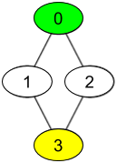

# Put question title here  Medium

## Detail of question

Example 1:

<pre>
Input:
Output:
Explanation:
</pre>

Example 2:

<pre>
Input:
Output:
Explanation:
</pre>

Constraints:

-   `Constraint 1`
-   `Constraint 2`
-   `Constraint 3`

 Related Topics 

-   `Topic 1`
-   `Topic 2`

 Hint 1 

Hint 1

 Hint 2 

Hint 2

 Hint 3 

Hint 3

 Hint 4 

Hint 4

