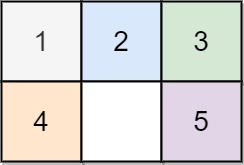
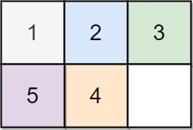

# 773. Sliding Puzzle  Hard

On an 2 x 3 board, there are five tiles labeled from 1 to 5, and an empty square represented by 0. A move consists of choosing 0 and a 4-directionally adjacent number and swapping it.

The state of the board is solved if and only if the board is [[1,2,3],[4,5,0]].

Given the puzzle board board, return the least number of moves required so that the state of the board is solved. If it is impossible for the state of the board to be solved, return -1.

Example 1:

<pre>
Input: board = [[1,2,3],[4,0,5]]
Output: 1
Explanation: Swap the 0 and the 5 in one move.
</pre>

Example 2:

<pre>
Input: board = [[1,2,3],[5,4,0]]
Output: -1
Explanation: No number of moves will make the board solved.
</pre>

Constraints:

- `board.length == 2`
- `board[i].length == 3`
- `0 <= board[i][j] <= 5`
- `Each value board[i][j] is unique.`

 Related Topics 

-   `BFS`

