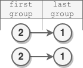

# 2074. Reverse Nodes in Even Length Groups  Medium

You are given the head of a linked list.

The nodes in the linked list are sequentially assigned to non-empty groups whose lengths form the sequence of the natural numbers (1, 2, 3, 4, ...). The length of a group is the number of nodes assigned to it. In other words,

- The 1st node is assigned to the first group.
- The 2nd and the 3rd nodes are assigned to the second group.
- The 4th, 5th, and 6th nodes are assigned to the third group, and so on.

Note that the length of the last group may be less than or equal to 1 + the length of the second to last group.

Reverse the nodes in each group with an even length, and return the head of the modified linked list.

Example 1:

<pre>
Input: head = [5,2,6,3,9,1,7,3,8,4]
Output: [5,6,2,3,9,1,4,8,3,7]
Explanation:
- The length of the first group is 1, which is odd, hence no reversal occurrs.
- The length of the second group is 2, which is even, hence the nodes are reversed.
- The length of the third group is 3, which is odd, hence no reversal occurrs.
- The length of the last group is 4, which is even, hence the nodes are reversed.
</pre>

Example 2:

<pre>
Input: head = [1,1,0,6]
Output: [1,0,1,6]
Explanation:
- The length of the first group is 1. No reversal occurrs.
- The length of the second group is 2. The nodes are reversed.
- The length of the last group is 1. No reversal occurrs.
</pre>

Example 3:

<pre>
Input: head = [2,1]
Output: [2,1]
Explanation:
- The length of the first group is 1. No reversal occurrs.
- The length of the last group is 1. No reversal occurrs.
</pre>

Constraints:

- `The number of nodes in the list is in the range [1, 10^5].`
- `0 <= Node.val <= 10^5`

 Related Topics 

-   `Linked List`