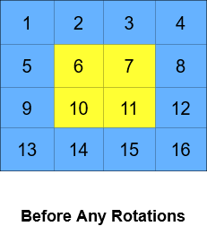
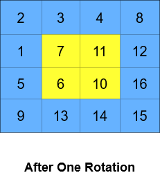
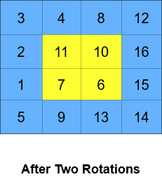

# Put question title here  Medium

You are given an m x n integer matrix grid​​​, where m and n are both even integers, and an integer k.

The matrix is composed of several layers, which is shown in the below image, where each color is its own layer:

A cyclic rotation of the matrix is done by cyclically rotating each layer in the matrix. To cyclically rotate a layer once, each element in the layer will take the place of the adjacent element in the counter-clockwise direction. An example rotation is shown below:

Return the matrix after applying k cyclic rotations to it.

Example 1:

<pre>
Input: grid = [[40,10],[30,20]], k = 1
Output: [[10,20],[40,30]]
Explanation: The figures above represent the grid at every state.
</pre>

Example 2:

 

<pre>
Input: grid = [[1,2,3,4],[5,6,7,8],[9,10,11,12],[13,14,15,16]], k = 2
Output: [[3,4,8,12],[2,11,10,16],[1,7,6,15],[5,9,13,14]]
Explanation: The figures above represent the grid at every state.
</pre>

Constraints:

- `m == grid.length`
- `n == grid[i].length`
- `2 <= m, n <= 50`
- `Both m and n are even integers.`
- `1 <= grid[i][j] <= 5000`
- `1 <= k <= 109`

 Related Topics 

-   `Simulation`
-   `Array`

