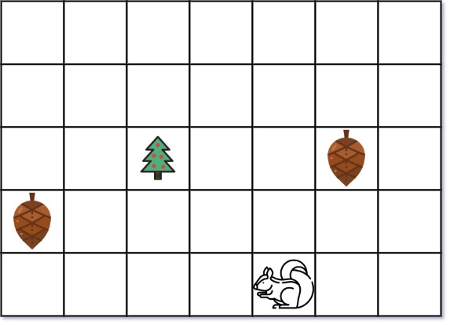
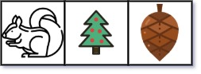

# 573. Squirrel Simulation  Medium

You are given two integers <code>height</code> and <code>width</code> representing a garden of size <code>height x width</code>. You are also given:

<ul>
	<li>an array <code>tree</code> where <code>tree = [treer, treec]</code> is the position of the tree in the garden,</li>
	<li>an array <code>squirrel</code> where <code>squirrel = [squirrelr, squirrelc]</code> is the position of the squirrel in the garden,</li>
	<li>and an array <code>nuts</code> where <code>nuts[i] = [nutir, nutic]</code> is the position of the <code>ith</code> nut in the garden.</li>
</ul>

The squirrel can only take at most one nut at one time and can move in four directions: up, down, left, and right, to the adjacent cell.

Return <em>the <strong>minimal distance</strong> for the squirrel to collect all the nuts and put them under the tree one by one</em>.

The <strong>distance</strong> is the number of moves.

&nbsp;

<strong class="example">Example 1:</strong>

<pre>
<strong>Input:</strong> height = 5, width = 7, tree = [2,2], squirrel = [4,4], nuts = [[3,0], [2,5]]
<strong>Output:</strong> 12
<strong>Explanation:</strong> The squirrel should go to the nut at [2, 5] first to achieve a minimal distance.
</pre>

<strong class="example">Example 2:</strong>

<pre>
<strong>Input:</strong> height = 1, width = 3, tree = [0,1], squirrel = [0,0], nuts = [[0,2]]
<strong>Output:</strong> 3
</pre>

&nbsp;

<strong>Constraints:</strong>

<ul>
	<li><code>1 &lt;= height, width &lt;= 100</code></li>
	<li><code>tree.length == 2</code></li>
	<li><code>squirrel.length == 2</code></li>
	<li><code>1 &lt;= nuts.length &lt;= 5000</code></li>
	<li><code>nuts[i].length == 2</code></li>
	<li><code>0 &lt;= treer, squirrelr, nutir &lt;= height</code></li>
	<li><code>0 &lt;= treec, squirrelc, nutic &lt;= width</code></li>
</ul>

 Related Topics 

-	`Array`
-	`Math`

 Hint 1 

Will Brute force solution works here? What will be its complexity?

 Hint 2 

Brute force definitely won't work here. Think of some simple solution. Take some example and make some observations.

 Hint 3 

Will order of nuts traversed by squirrel is important or only first nut traversed by squirrel is important?

 Hint 4 

Are there some paths which squirrel have to cover in any case? If yes, what are they?

 Hint 5 

Did you notice only first nut traversed by squirrel matters? Obviously squirrel will choose first nut which will result in minimum distance.

