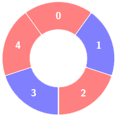
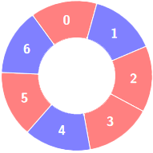

# 3208. Alternating Groups II  Medium

There is a circle of red and blue tiles. You are given an array of integers <code>colors</code> and an integer <code>k</code>. The color of tile <code>i</code> is represented by <code>colors[i]</code>:

<ul>
	<li><code>colors[i] == 0</code> means that tile <code>i</code> is <strong>red</strong>.</li>
	<li><code>colors[i] == 1</code> means that tile <code>i</code> is <strong>blue</strong>.</li>
</ul>

An <strong>alternating</strong> group is every <code>k</code> contiguous tiles in the circle with <strong>alternating</strong> colors (each tile in the group except the first and last one has a different color from its <strong>left</strong> and <strong>right</strong> tiles).

Return the number of <strong>alternating</strong> groups.

<strong>Note</strong> that since <code>colors</code> represents a <strong>circle</strong>, the <strong>first</strong> and the <strong>last</strong> tiles are considered to be next to each other.

&nbsp;

<strong class="example">Example 1:</strong>

<strong>Input:</strong> colors = [0,1,0,1,0], k = 3

<strong>Output:</strong> 3

<strong>Explanation:</strong>

<strong></strong>

Alternating groups:

<strong class="example">Example 2:</strong>

<strong>Input:</strong> colors = [0,1,0,0,1,0,1], k = 6

<strong>Output:</strong> 2

<strong>Explanation:</strong>

<strong></strong>

Alternating groups:

<strong class="example">Example 3:</strong>

<strong>Input:</strong> colors = [1,1,0,1], k = 4

<strong>Output:</strong> 0

<strong>Explanation:</strong>

&nbsp;

<strong>Constraints:</strong>

<ul>
	<li><code>3 &lt;= colors.length &lt;= 105</code></li>
	<li><code>0 &lt;= colors[i] &lt;= 1</code></li>
	<li><code>3 &lt;= k &lt;= colors.length</code></li>
</ul>

 Related Topics 

-	`Array`
-	`Sliding Window`

 Hint 1 

Try to find a tile that has the same color as its next tile (if it exists).

 Hint 2 

Then try to find maximal alternating groups by starting a single for loop from that tile.

