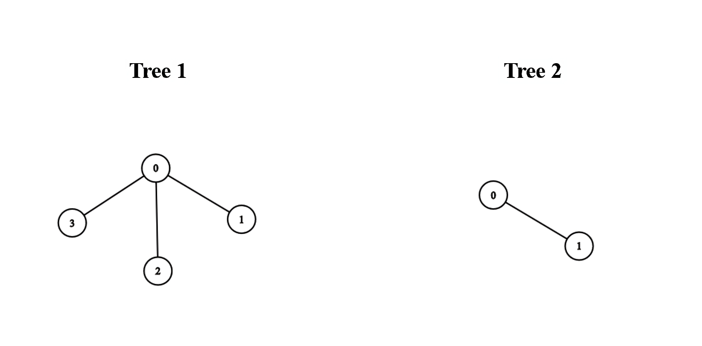
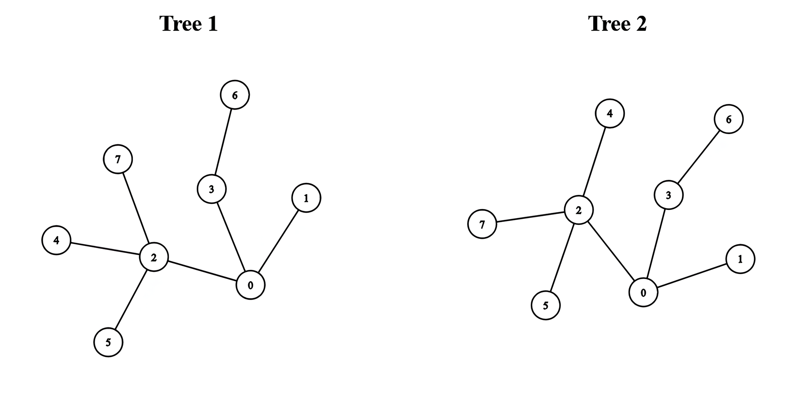

# 3203. Find Minimum Diameter After Merging Two Trees  Hard

There exist two <strong>undirected </strong>trees with <code>n</code> and <code>m</code> nodes, numbered from <code>0</code> to <code>n - 1</code> and from <code>0</code> to <code>m - 1</code>, respectively. You are given two 2D integer arrays <code>edges1</code> and <code>edges2</code> of lengths <code>n - 1</code> and <code>m - 1</code>, respectively, where <code>edges1[i] = [ai, bi]</code> indicates that there is an edge between nodes <code>ai</code> and <code>bi</code> in the first tree and <code>edges2[i] = [ui, vi]</code> indicates that there is an edge between nodes <code>ui</code> and <code>vi</code> in the second tree.

You must connect one node from the first tree with another node from the second tree with an edge.

Return the <strong>minimum </strong>possible <strong>diameter </strong>of the resulting tree.

The <strong>diameter</strong> of a tree is the length of the <em>longest</em> path between any two nodes in the tree.

&nbsp;

<strong class="example">Example 1:</strong>

<strong>Input:</strong> edges1 = [[0,1],[0,2],[0,3]], edges2 = [[0,1]]

<strong>Output:</strong> 3

<strong>Explanation:</strong>

We can obtain a tree of diameter 3 by connecting node 0 from the first tree with any node from the second tree.

<strong class="example">Example 2:</strong>

<strong>Input:</strong> edges1 = [[0,1],[0,2],[0,3],[2,4],[2,5],[3,6],[2,7]], edges2 = [[0,1],[0,2],[0,3],[2,4],[2,5],[3,6],[2,7]]

<strong>Output:</strong> 5

<strong>Explanation:</strong>

We can obtain a tree of diameter 5 by connecting node 0 from the first tree with node 0 from the second tree.

&nbsp;

<strong>Constraints:</strong>

<ul>
	<li><code>1 &lt;= n, m &lt;= 105</code></li>
	<li><code>edges1.length == n - 1</code></li>
	<li><code>edges2.length == m - 1</code></li>
	<li><code>edges1[i].length == edges2[i].length == 2</code></li>
	<li><code>edges1[i] = [ai, bi]</code></li>
	<li><code>0 &lt;= ai, bi &lt; n</code></li>
	<li><code>edges2[i] = [ui, vi]</code></li>
	<li><code>0 &lt;= ui, vi &lt; m</code></li>
	<li>The input is generated such that <code>edges1</code> and <code>edges2</code> represent valid trees.</li>
</ul>

 Related Topics 

-	`Tree`
-	`Depth-First Search`
-	`Breadth-First Search`
-	`Graph`

 Hint 1 

Suppose that we connected node <code>a</code> in tree1 with node <code>b</code> in tree2. The diameter length of the resulting tree will be the largest of the following 3 values: 
<ol>
<li>The diameter of tree 1.</li>
<li>The diameter of tree 2.</li>
<li>The length of the longest path that starts at node <code>a</code> and that is completely within Tree 1 + The length of the longest path that starts at node <code>b</code> and that is completely within Tree 2 + 1.</li>
</ol> 
The added one in the third value is due to the additional edge that we have added between trees 1 and 2.

 Hint 2 

Values 1 and 2 are constant regardless of our choice of <code>a</code> and <code>b</code>. Therefore, we need to pick <code>a</code> and <code>b</code> in such a way that minimizes value 3.

 Hint 3 

If we pick <code>a</code> and <code>b</code> optimally, they will be in the diameters of Tree 1 and Tree 2, respectively. Exactly which nodes of the diameter should we pick?

 Hint 4 

<code>a</code> is the center of the diameter of tree 1, and <code>b</code> is the center of the diameter of tree 2.

