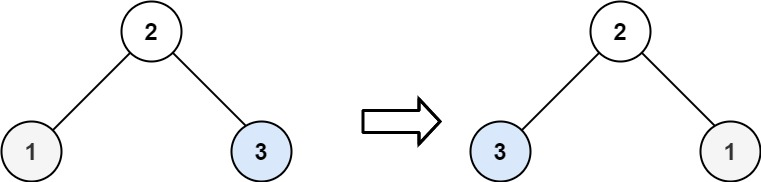

# 226. Invert Binary Tree  Easy

Given the root of a binary tree, invert the tree, and return its root.

Example 1:

<pre>
Input: root = [4,2,7,1,3,6,9]
Output: [4,7,2,9,6,3,1]
</pre>

Example 2:

<pre>
Input: root = [2,1,3]
Output: [2,3,1]
</pre>

Constraints:

- `The number of nodes in the tree is in the range [0, 100].`
- `-100 <= Node.val <= 100`

 Related Topics 

-   `Binary Tree`
-   `Depth-first Search`

