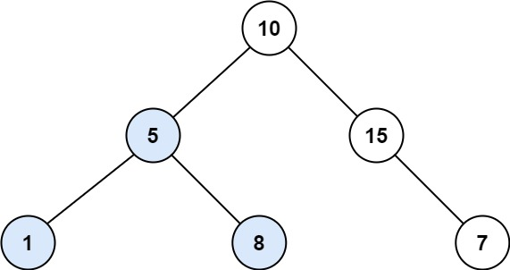

# 333. Largest BST Subtree  Medium

Given the root of a binary tree, find the largest subtree, which is also a Binary Search Tree (BST), where the largest means subtree has the largest number of nodes.

A <strong>Binary Search Tree (BST)</strong> is a tree in which all the nodes follow the below-mentioned properties:

<ul>
	<li>The left subtree values are less than the value of their parent (root) node&#39;s value.</li>
	<li>The right subtree values are greater than the value of their parent (root) node&#39;s value.</li>
</ul>

<strong>Note:</strong> A subtree must include all of its descendants.

&nbsp;

<strong class="example">Example 1:</strong>

<strong></strong>

<pre>
<strong>Input:</strong> root = [10,5,15,1,8,null,7]
<strong>Output:</strong> 3
<strong>Explanation: </strong>The Largest BST Subtree in this case is the highlighted one. The return value is the subtree&#39;s size, which is 3.</pre>

<strong class="example">Example 2:</strong>

<pre>
<strong>Input:</strong> root = [4,2,7,2,3,5,null,2,null,null,null,null,null,1]
<strong>Output:</strong> 2
</pre>

&nbsp;

<strong>Constraints:</strong>

<ul>
	<li>The number of nodes in the tree is in the range <code>[0, 104]</code>.</li>
	<li><code>-104 &lt;= Node.val &lt;= 104</code></li>
</ul>

&nbsp;

<strong>Follow up:</strong> Can you figure out ways to solve it with <code>O(n)</code> time complexity?

 Related Topics 

-	`Dynamic Programming`
-	`Tree`
-	`Depth-First Search`
-	`Binary Search Tree`
-	`Binary Tree`

 Hint 1 

You can recursively use algorithm similar to <a href="https://leetcode.com/problems/validate-binary-search-tree/">98. Validate Binary Search Tree</a> at each node of the tree, which will result in O(nlogn) time complexity.

