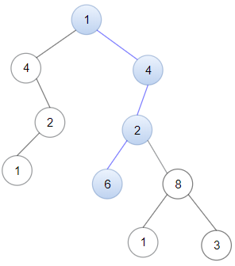

# 1367. Linked List in Binary Tree  Medium

Given a binary tree root and a linked list with head as the first node. 

Return True if all the elements in the linked list starting from the head correspond to some downward path connected in the binary tree otherwise return False.

In this context downward path means a path that starts at some node and goes downwards.

Example 1:

<pre>
Input: head = [4,2,8], root = [1,4,4,null,2,2,null,1,null,6,8,null,null,null,null,1,3]
Output: true
Explanation: Nodes in blue form a subpath in the binary Tree.  
</pre>

Example 2:

<pre>
Input: head = [1,4,2,6], root = [1,4,4,null,2,2,null,1,null,6,8,null,null,null,null,1,3]
Output: true
</pre>

Constraints:

- `The number of nodes in the tree will be in the range [1, 2500].`
- `The number of nodes in the list will be in the range [1, 100].`
- `1 <= Node.val <= 100 for each node in the linked list and binary tree.`

 Related Topics 

-   `Binary Tree`
-   `Linked List`
-   `DFS`

