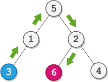

# 2096. Step-By-Step Directions From a Binary Tree Node to Another  Medium

You are given the root of a binary tree with n nodes. Each node is uniquely assigned a value from 1 to n. You are also given an integer startValue representing the value of the start node s, and a different integer destValue representing the value of the destination node t.

Find the shortest path starting from node s and ending at node t. Generate step-by-step directions of such path as a string consisting of only the uppercase letters 'L', 'R', and 'U'. Each letter indicates a specific direction:

- 'L' means to go from a node to its left child node.
- 'R' means to go from a node to its right child node.
- 'U' means to go from a node to its parent node.
Return the step-by-step directions of the shortest path from node s to node t.

Example 1:

<pre>
Input: root = [5,1,2,3,null,6,4], startValue = 3, destValue = 6
Output: "UURL"
Explanation: The shortest path is: 3 → 1 → 5 → 2 → 6.
</pre>

Example 2:

<pre>
Input: root = [2,1], startValue = 2, destValue = 1
Output: "L"
Explanation: The shortest path is: 2 → 1.
</pre>

Constraints:

- `The number of nodes in the tree is n.`
- `2 <= n <= 10^5`
- `1 <= Node.val <= n`
- `All the values in the tree are unique.`
- `1 <= startValue, destValue <= n`
- `startValue != destValue`

 Related Topics 

-   `Tree`
-   `DFS/BFS`

