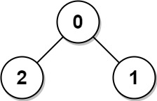
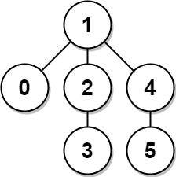

# 1245. Tree Diameter  Medium

The <strong>diameter</strong> of a tree is <strong>the number of edges</strong> in the longest path in that tree.

There is an undirected tree of <code>n</code> nodes labeled from <code>0</code> to <code>n - 1</code>. You are given a 2D array <code>edges</code> where <code>edges.length == n - 1</code> and <code>edges[i] = [ai, bi]</code> indicates that there is an undirected edge between nodes <code>ai</code> and <code>bi</code> in the tree.

Return <em>the <strong>diameter</strong> of the tree</em>.

&nbsp;

<strong class="example">Example 1:</strong>

<pre>
<strong>Input:</strong> edges = [[0,1],[0,2]]
<strong>Output:</strong> 2
<strong>Explanation:</strong> The longest path of the tree is the path 1 - 0 - 2.
</pre>

<strong class="example">Example 2:</strong>

<pre>
<strong>Input:</strong> edges = [[0,1],[1,2],[2,3],[1,4],[4,5]]
<strong>Output:</strong> 4
<strong>Explanation:</strong> The longest path of the tree is the path 3 - 2 - 1 - 4 - 5.
</pre>

&nbsp;

<strong>Constraints:</strong>

<ul>
	<li><code>n == edges.length + 1</code></li>
	<li><code>1 &lt;= n &lt;= 104</code></li>
	<li><code>0 &lt;= ai, bi &lt; n</code></li>
	<li><code>ai != bi</code></li>
</ul>

 Related Topics 

-	`Tree`
-	`Depth-First Search`
-	`Breadth-First Search`
-	`Graph`
-	`Topological Sort`

 Hint 1 

Start at any node A and traverse the tree to find the furthest node from it, let's call it B.

 Hint 2 

Having found the furthest node B, traverse the tree from B to find the furthest node from it, lets call it C.

 Hint 3 

The distance between B and C is the tree diameter.

